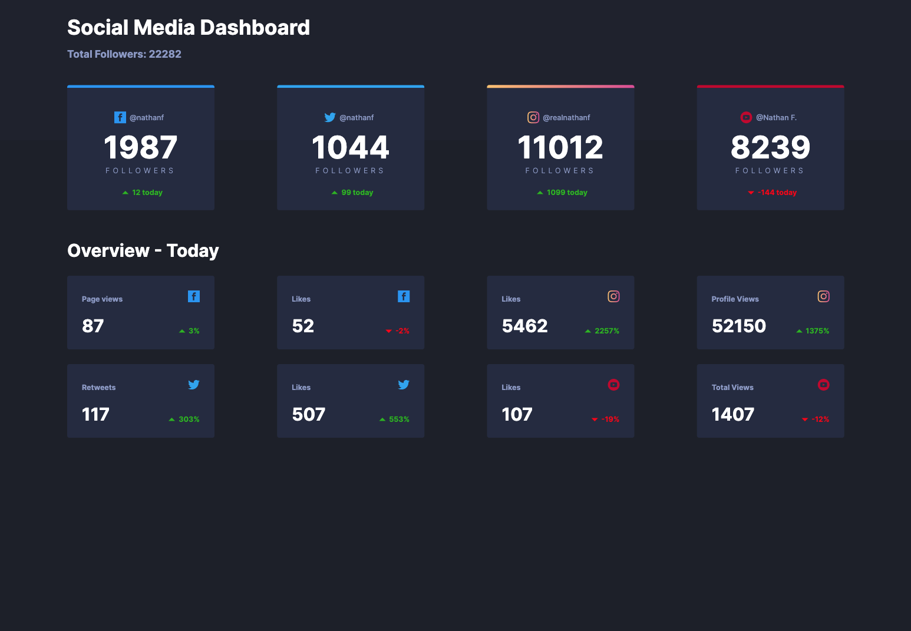
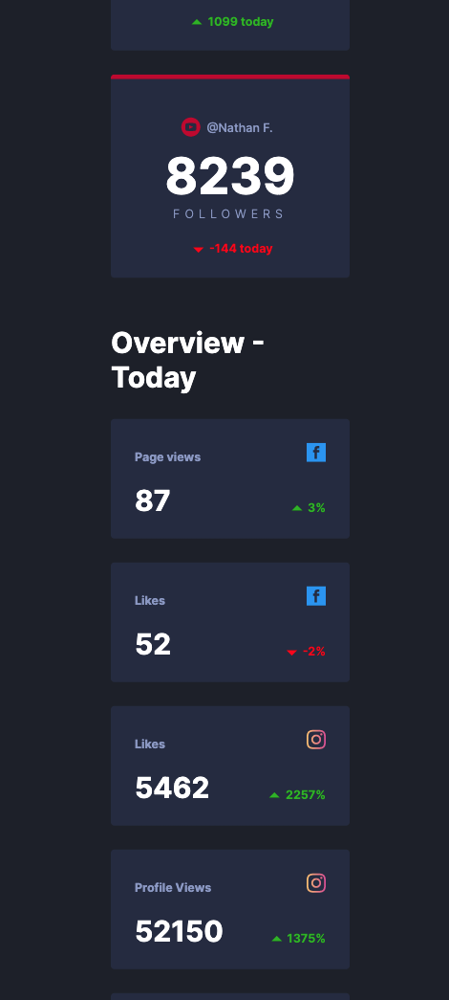

# Social media dashboard

## School project

A simple UI design school project.

- [About the project](#about-the-project)
- [Setup requirements](#setup-requirements)
- [How to start](#how-to-start)
- [Main technologies and services](#main-technologies-and-services)
- [Screenshots](#screenshots)

## About the project

Data is served locally. The main purpose to practice React components with Sass. Layout must be responsive too.

## Setup requirements

- Terminal
- Node.js
- Visual Studio Code

## How to start

1. Clone the repository and open with Visual Studio Code

2. Using the terminal:

```
cd app
npm install
cd ..
```

3. Start the localhost

```
cd app
npm start
```

## Main technologies and services

### Front-end

React, JS \
CSS, Sass

## Screenshots



